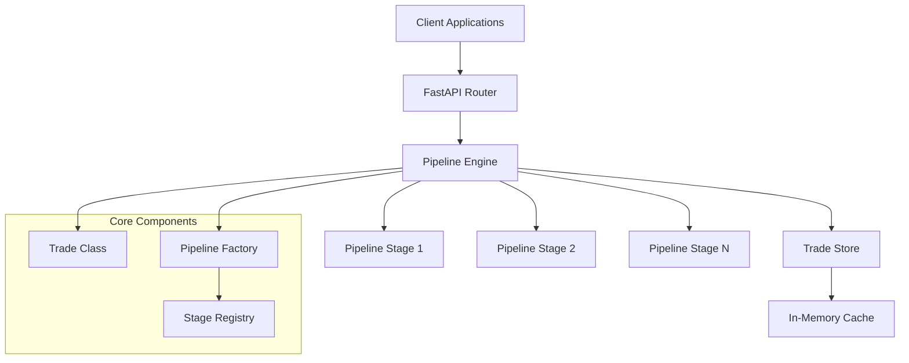

# Trade API Design Document

## Overview

The Trade API is a FastAPI-based system that processes financial swap deals through modular, configurable pipelines. The architecture emphasizes JSON-first processing, composition over inheritance, and pluggable pipeline stages to maximize flexibility while maintaining type safety where necessary.

## Architecture

### High-Level Architecture



### Component Responsibilities

- **FastAPI Router**: HTTP endpoint handling and request/response serialization
- **Pipeline Engine**: Orchestrates execution of pipeline stages
- **Pipeline Factory**: Dynamically constructs pipelines based on operation and trade type
- **Stage Registry**: Manages available pipeline stages and their configurations
- **Trade Class**: Lightweight wrapper around JSON trade data
- **Trade Store**: In-memory persistence layer

## Components and Interfaces

### Trade Class

```python
class Trade:
    """Lightweight composition-based wrapper for trade JSON data."""
    
    def __init__(self, data: Dict[str, Any]):
        self._data = data
    
    @property
    def data(self) -> Dict[str, Any]:
        """Direct access to underlying JSON data."""
        return self._data
    
    def get(self, path: str, default: Any = None) -> Any:
        """Get nested property using dot notation."""
        pass
    
    def set(self, path: str, value: Any) -> None:
        """Set nested property using dot notation."""
        pass
    
    @property
    def trade_type(self) -> str:
        return self._data.get("tradeType", "")
    
    @property
    def trade_id(self) -> str:
        return self._data.get("tradeId", "")
```

### Pipeline Stage Interface

```python
from abc import ABC, abstractmethod
from typing import Dict, Any, Optional

class PipelineStage(ABC):
    """Base interface for all pipeline stages."""
    
    @abstractmethod
    def execute(self, trade: Trade, context: Dict[str, Any]) -> Trade:
        """Execute the stage operation on trade data."""
        pass
    
    @property
    @abstractmethod
    def stage_name(self) -> str:
        """Unique identifier for this stage."""
        pass
    
    def validate_preconditions(self, trade: Trade) -> Optional[str]:
        """Validate if stage can execute. Return error message if not."""
        return None
```

### Pipeline Engine

```python
class PipelineEngine:
    """Orchestrates execution of pipeline stages."""
    
    def __init__(self, stage_registry: StageRegistry):
        self.stage_registry = stage_registry
    
    def execute_pipeline(self, 
                        stages: List[str], 
                        trade: Trade, 
                        context: Dict[str, Any] = None) -> Trade:
        """Execute a sequence of pipeline stages."""
        pass
```

### Trade Store Interface

```python
class TradeStore(ABC):
    """Abstract interface for trade persistence."""
    
    @abstractmethod
    def save(self, trade_id: str, trade_data: Dict[str, Any]) -> bool:
        pass
    
    @abstractmethod
    def get(self, trade_id: str) -> Optional[Dict[str, Any]]:
        pass
    
    @abstractmethod
    def exists(self, trade_id: str) -> bool:
        pass
    
    @abstractmethod
    def list_trades(self) -> List[str]:
        pass

class InMemoryTradeStore(TradeStore):
    """In-memory implementation using Python dict."""
    pass
```

## Data Models

### API Request/Response Models

```python
from pydantic import BaseModel
from typing import Dict, Any, Optional, List

class NewTradeRequest(BaseModel):
    trade_type: str
    user_id: Optional[str] = None
    counterparty_a: Optional[Dict[str, str]] = None
    counterparty_b: Optional[Dict[str, str]] = None

class SaveTradeRequest(BaseModel):
    trade_data: Dict[str, Any]
    user_id: Optional[str] = None
    comment: Optional[str] = None

class ValidateTradeRequest(BaseModel):
    trade_data: Dict[str, Any]

class TradeResponse(BaseModel):
    success: bool
    trade_data: Optional[Dict[str, Any]] = None
    errors: List[str] = []
    warnings: List[str] = []
```

### Trade Templates

The system maintains JSON templates for each trade type:

```python
TRADE_TEMPLATES = {
    "InterestRateSwap": {
        "tradeType": "InterestRateSwap",
        "assetClass": "Rates",
        "legs": [
            {"legId": "FIXED", "legType": "Fixed"},
            {"legId": "FLOAT", "legType": "Floating"}
        ],
        "specific": {"rateFamily": "VanillaIRS"}
    },
    "OvernightIndexSwap": {
        "tradeType": "OvernightIndexSwap", 
        "assetClass": "Rates",
        "legs": [
            {"legId": "FIXED", "legType": "Fixed"},
            {"legId": "OIS_FLOAT", "legType": "Floating"}
        ],
        "specific": {
            "rateFamily": "OIS",
            "compounding": "CompoundedInArrears"
        }
    }
    # Additional templates for BasisSwap, CrossCurrencySwap
}
```

## Correctness Properties

*A property is a characteristic or behavior that should hold true across all valid executions of a system-essentially, a formal statement about what the system should do. Properties serve as the bridge between human-readable specifications and machine-verifiable correctness guarantees.*

<function_calls>
<invoke name="prework">
<parameter name="featureName">trade-api

Property 1: Trade ID generation consistency
*For any* supported trade type, creating a new trade should generate a trade ID that matches the format SWAP-YYYYMMDD-TYPE-NNNN
**Validates: Requirements 1.2**

Property 2: Template field population
*For any* new trade request with optional parameters, the generated template should contain all provided parameters in their correct JSON locations
**Validates: Requirements 1.3, 1.4**

Property 3: JSON round-trip preservation
*For any* valid trade JSON data, saving and then retrieving the trade should return identical JSON structure
**Validates: Requirements 2.3, 6.3**

Property 4: Version increment consistency
*For any* existing trade, updating it should increment the version number by exactly one and add a new lifecycle entry
**Validates: Requirements 2.2**

Property 5: Pipeline stage execution order
*For any* pipeline configuration, stages should execute in the specified sequence with each stage receiving the output of the previous stage
**Validates: Requirements 4.2**

Property 6: Validation error completeness
*For any* invalid trade data, the validation endpoint should return all validation errors without stopping at the first failure
**Validates: Requirements 3.3**

Property 7: Trade store key uniqueness
*For any* trade ID, the store should maintain exactly one trade record per ID, with later saves overwriting earlier ones
**Validates: Requirements 6.2**

Property 8: Pipeline error handling
*For any* pipeline stage that fails, execution should halt immediately and return error information without executing subsequent stages
**Validates: Requirements 4.3**

Property 9: JSON flexibility preservation
*For any* valid JSON trade structure, the Trade class should provide access to all original properties without schema enforcement
**Validates: Requirements 5.3**

Property 10: Trade type pipeline selection
*For any* trade type and operation combination, the system should select the appropriate pipeline stages without manual configuration
**Validates: Requirements 4.1**

## Error Handling

### Error Categories

1. **Validation Errors**: Invalid trade data, missing required fields, business rule violations
2. **Pipeline Errors**: Stage execution failures, precondition violations
3. **Storage Errors**: Persistence failures, concurrency conflicts
4. **System Errors**: Unexpected exceptions, resource constraints

### Error Response Format

```python
class ErrorResponse(BaseModel):
    success: bool = False
    error_code: str
    message: str
    details: Optional[Dict[str, Any]] = None
    timestamp: str
```

### Error Handling Strategy

- **Fail Fast**: Pipeline execution stops on first error
- **Error Aggregation**: Validation collects all errors before returning
- **Graceful Degradation**: Non-critical failures logged but don't stop processing
- **Error Context**: Include relevant trade data and stage information in error responses

## Testing Strategy

### Dual Testing Approach

The system requires both unit testing and property-based testing to ensure correctness:

**Unit Tests**:
- Test specific pipeline stages with known inputs
- Verify API endpoint request/response handling
- Test error conditions and edge cases
- Validate trade store operations

**Property-Based Tests**:
- Verify universal properties across all trade types and inputs
- Test JSON round-trip consistency
- Validate pipeline execution properties
- Test concurrent access patterns

### Property-Based Testing Framework

The system will use **Hypothesis** for property-based testing in Python. Each property-based test will:
- Run a minimum of 100 iterations
- Use smart generators for trade data
- Be tagged with comments referencing design document properties

**Test Configuration**:
```python
from hypothesis import given, strategies as st, settings

@settings(max_examples=100)
@given(trade_data=trade_json_strategy())
def test_json_round_trip_property(trade_data):
    """**Feature: trade-api, Property 3: JSON round-trip preservation**"""
    # Test implementation
```

### Test Data Generation

Smart generators will create realistic trade data:
- Valid trade IDs following the required format
- Appropriate date ranges and business day handling
- Realistic financial values and rate structures
- Valid counterparty and user information

### Integration Testing

- End-to-end API workflow testing
- Pipeline composition and execution testing
- Concurrent request handling
- Memory usage and performance validation

## Implementation Notes

### Technology Stack
- **FastAPI**: Web framework for API endpoints
- **Pydantic**: Request/response validation only
- **Hypothesis**: Property-based testing
- **pytest**: Unit testing framework
- **uvicorn**: ASGI server

### Performance Considerations
- In-memory store for fast access during development
- Lazy loading of pipeline stages
- Minimal object creation overhead
- JSON processing optimization

### Future Extensibility
- Plugin architecture for new trade types
- Database abstraction for PostgreSQL migration
- Pipeline stage marketplace/registry
- Configuration-driven pipeline construction