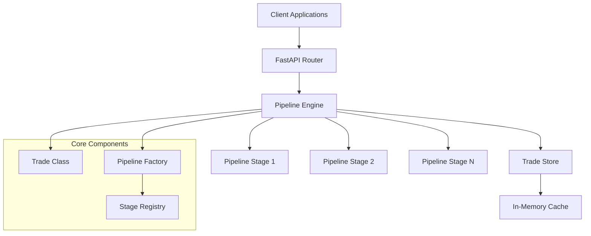

# Trade API Design Document

## Overview

The Trade API is a FastAPI-based system that processes financial swap deals through modular, configurable pipelines. The architecture emphasizes JSON-first processing, composition over inheritance, and pluggable pipeline stages to maximize flexibility while maintaining type safety where necessary.

## Architecture

### High-Level Architecture



### Component Responsibilities

- **FastAPI Router**: HTTP endpoint handling and request/response serialization
- **Pipeline Engine**: Orchestrates execution of pipeline stages
- **Pipeline Factory**: Dynamically constructs pipelines based on operation and trade type
- **Stage Registry**: Manages available pipeline stages and their configurations
- **Trade Class**: Lightweight wrapper around JSON trade data
- **Trade Store**: In-memory persistence layer

## Components and Interfaces

### Trade Class

```python
class Trade:
    """Lightweight composition-based wrapper for trade JSON data.
    
    Uses orjson, jmespath, and glom for high-performance JSON operations.
    """
    
    def __init__(self, data: Union[Dict[str, Any], str, bytes]):
        """Initialize from dict, JSON string, or JSON bytes."""
        self._data = orjson.loads(data) if isinstance(data, (str, bytes)) else data
    
    @property
    def data(self) -> Dict[str, Any]:
        """Direct access to underlying JSON data."""
        return self._data
    
    def jmesget(self, path: str, default: Any = None) -> Any:
        """Get data using JMESPath (for complex queries, filters, projections).
        
        Examples:
            trade.jmesget("legs[0].rate.currency")
            trade.jmesget("legs[?legType=='Fixed'].rate")
            trade.jmesget("legs[*].legId")
        """
        pass
    
    def glomset(self, path: str, value: Any) -> None:
        """Set nested property using glom path notation.
        
        Examples:
            trade.glomset("legs.0.rate", 0.05)
            trade.glomset("specific.rateFamily", "VanillaIRS")
        """
        pass
    
    def to_json(self) -> bytes:
        """Serialize to JSON bytes using orjson."""
        pass
    
    def to_readonly(self) -> 'ReadOnlyTrade':
        """Convert to immutable read-only trade with cached properties."""
        pass


class ReadOnlyTrade:
    """Immutable read-only view with cached properties.
    
    Provides same read interface as Trade but prevents modifications
    and caches expensive property lookups.
    """
    
    def __init__(self, data: Union[Dict[str, Any], Trade]):
        """Initialize with immutable MappingProxyType wrapper."""
        self._data = MappingProxyType(data._data if isinstance(data, Trade) else data)
    
    @property
    def data(self) -> MappingProxyType:
        """Immutable view of underlying data."""
        return self._data
    
    def jmesget(self, path: str, default: Any = None) -> Any:
        """Get data using JMESPath (same as Trade)."""
        pass
    
    @cached_property
    def trade_id(self) -> str:
        """Cached trade ID lookup."""
        pass
    
    @cached_property
    def trade_type(self) -> str:
        """Cached trade type lookup."""
        pass
    
    def to_json(self) -> bytes:
        """Serialize to JSON bytes."""
        pass
```

### Pipeline Stage Interface

```python
from abc import ABC, abstractmethod
from typing import Dict, Any, Optional

class PipelineStage(ABC):
    """Base interface for all pipeline stages."""
    
    @abstractmethod
    def execute(self, trade: Trade, context: Dict[str, Any]) -> Trade:
        """Execute the stage operation on trade data."""
        pass
    
    @property
    @abstractmethod
    def stage_name(self) -> str:
        """Unique identifier for this stage."""
        pass
    
    def validate_preconditions(self, trade: Trade) -> Optional[str]:
        """Validate if stage can execute. Return error message if not."""
        return None
```

### Pipeline Engine

```python
class PipelineEngine:
    """Orchestrates execution of pipeline stages."""
    
    def __init__(self, stage_registry: StageRegistry):
        self.stage_registry = stage_registry
    
    def execute_pipeline(self, 
                        stages: List[str], 
                        trade: Trade, 
                        context: Dict[str, Any] = None) -> Trade:
        """Execute a sequence of pipeline stages."""
        pass
```

### Trade Store Interface

```python
class TradeStore(ABC):
    """Abstract interface for trade persistence."""
    
    @abstractmethod
    def save(self, trade_id: str, trade_data: Dict[str, Any]) -> bool:
        pass
    
    @abstractmethod
    def get(self, trade_id: str) -> Optional[Dict[str, Any]]:
        pass
    
    @abstractmethod
    def exists(self, trade_id: str) -> bool:
        pass
    
    @abstractmethod
    def list_trades(self) -> List[str]:
        pass

class InMemoryTradeStore(TradeStore):
    """In-memory implementation using Python dict."""
    pass
```

## Data Models

### API Request/Response Models

```python
from pydantic import BaseModel
from typing import Dict, Any, Optional, List

class NewTradeRequest(BaseModel):
    trade_type: str
    user_id: Optional[str] = None
    counterparty_a: Optional[Dict[str, str]] = None
    counterparty_b: Optional[Dict[str, str]] = None

class SaveTradeRequest(BaseModel):
    trade_data: Dict[str, Any]
    user_id: Optional[str] = None
    comment: Optional[str] = None

class ValidateTradeRequest(BaseModel):
    trade_data: Dict[str, Any]

class TradeResponse(BaseModel):
    success: bool
    trade_data: Optional[Dict[str, Any]] = None
    errors: List[str] = []
    warnings: List[str] = []
```

### Trade Templates

The system uses a hierarchical, component-based template system for trade generation.

## Template Factory Architecture

### Overview

The Trade API uses a **hierarchical component-based template system** to generate trade structures. This architecture enables:
- **Reusability**: Share common components across trade types
- **Maintainability**: Change base components to affect all descendants
- **Extensibility**: Add new trade types by creating new component files
- **Flexibility**: Override at any inheritance level
- **Version Control**: Track template changes independently from trade data

### Key Concepts

**Template Schema Version vs Trade Version**:
- **Template Schema Version**: Version of the template structure/format (e.g., v1 uses `payerPartyCode`, v2 uses `payer`)
- **Trade Version**: Version of a specific trade instance, incremented on amendments (business version)
- These are completely independent concepts

**Component Inheritance**:
- Components are organized in a hierarchy from general to specific
- Child components inherit and can override parent component fields
- Merge order: base → type → subtype → market → leg-specific

### Directory Structure

```
tcs-api/templates/
├── schema-version/          # Template schema version (v1, v2, etc.)
│   └── v1/                  # Current schema version
│       ├── base/
│       │   ├── trade-base.json           # Universal trade fields
│       │   ├── general-base.json         # Base general section
│       │   ├── swap-details-base.json    # Base swap details
│       │   └── swap-leg-base.json        # Base leg structure (ALL legs)
│       │
│       ├── swap-types/
│       │   ├── irs/                      # Interest Rate Swaps
│       │   │   ├── irs-base.json         # Common to ALL IRS types
│       │   │   ├── irs-leg-base.json     # Common to ALL IRS legs
│       │   │   ├── vanilla/
│       │   │   │   ├── vanilla-irs.json  # Vanilla-specific overrides
│       │   │   │   └── vanilla-irs-legs.json
│       │   │   ├── ois/
│       │   │   │   ├── ois.json
│       │   │   │   └── ois-legs.json
│       │   │   ├── amortizing/
│       │   │   │   ├── amortizing-irs.json
│       │   │   │   └── amortizing-irs-legs.json
│       │   │   └── basis/
│       │   │       ├── basis-swap.json
│       │   │       └── basis-swap-legs.json
│       │   │
│       │   └── xccy/                     # Cross Currency Swaps
│       │       ├── xccy-base.json
│       │       └── xccy-leg-base.json
│       │
│       ├── leg-types/
│       │   ├── fixed-leg.json            # Fixed leg specifics
│       │   ├── floating-ibor-leg.json    # IBOR floating specifics
│       │   ├── floating-ois-leg.json     # OIS floating specifics
│       │   ├── inflation-cpi-leg.json    # CPI inflation specifics
│       │   └── inflation-yoy-leg.json    # YoY inflation specifics
│       │
│       └── conventions/
│           ├── eur-conventions.json      # EUR market conventions
│           ├── usd-conventions.json      # USD market conventions
│           └── gbp-conventions.json      # GBP market conventions
```

### Component Inheritance Chain

**Example: Vanilla EUR IRS with Fixed + Floating legs**

```python
# Merge order (later overrides earlier):
components = [
    # 1. Universal base
    "base/trade-base.json",
    "base/general-base.json",
    
    # 2. IRS base (common to all IRS)
    "swap-types/irs/irs-base.json",
    
    # 3. Vanilla IRS specifics
    "swap-types/irs/vanilla/vanilla-irs.json",
    
    # 4. Market conventions
    "conventions/eur-conventions.json",
    
    # 5. Legs (with inheritance):
    {
        "legs": [
            # Fixed leg: base → irs-leg-base → vanilla-leg → fixed-leg
            merge(
                "base/swap-leg-base.json",
                "swap-types/irs/irs-leg-base.json",
                "swap-types/irs/vanilla/vanilla-irs-legs.json",
                "leg-types/fixed-leg.json"
            ),
            # Floating leg: base → irs-leg-base → vanilla-leg → floating-ibor
            merge(
                "base/swap-leg-base.json",
                "swap-types/irs/irs-leg-base.json",
                "swap-types/irs/vanilla/vanilla-irs-legs.json",
                "leg-types/floating-ibor-leg.json"
            )
        ]
    }
]
```

### Example Component Files

**base/swap-leg-base.json** (ALL legs inherit):
```json
{
  "legType": "",
  "currency": "",
  "notional": 0,
  "settlementLag": 2,
  "schedule": {
    "frequency": "",
    "startDate": "",
    "endDate": ""
  },
  "pricing": {
    "dayCountBasisIsda": ""
  }
}
```

**swap-types/irs/irs-leg-base.json** (ALL IRS legs inherit):
```json
{
  "payerPartyCode": "",
  "receiverPartyCode": "",
  "businessDayConvention": "Modified Following",
  "pricing": {
    "dayCountBasisIsda": "ACT/360"
  }
}
```

**swap-types/irs/vanilla/vanilla-irs-legs.json** (Vanilla IRS leg specifics):
```json
{
  "schedule": {
    "frequency": "semiannual"
  }
}
```

**leg-types/fixed-leg.json** (Fixed leg specifics):
```json
{
  "rateType": "fixed",
  "pricing": {
    "interestRate": 0.0,
    "dayCountBasisIsda": "30/360"
  }
}
```

**Result after merging** (Fixed leg for Vanilla IRS):
```json
{
  "legType": "",
  "currency": "",
  "notional": 0,
  "settlementLag": 2,
  "payerPartyCode": "",
  "receiverPartyCode": "",
  "businessDayConvention": "Modified Following",
  "rateType": "fixed",
  "schedule": {
    "frequency": "semiannual",
    "startDate": "",
    "endDate": ""
  },
  "pricing": {
    "interestRate": 0.0,
    "dayCountBasisIsda": "30/360"
  }
}
```

### TradeTemplateFactory Interface

```python
class TradeTemplateFactory:
    """Factory for creating TradeAssemblers with hierarchical template inheritance.
    
    Composes trade templates from JSON component files based on:
    - Trade type (InterestRateSwap, CrossCurrencySwap, etc.)
    - Subtype (Vanilla, OIS, Basis, Amortizing, etc.)
    - Currency/Market (EUR, USD, GBP - affects conventions)
    - Leg configurations (Fixed, Floating IBOR, Floating OIS, etc.)
    - Template schema version (v1, v2, etc.)
    
    Design principles:
    - Loads JSON components from template files
    - Applies hierarchical inheritance (base → type → subtype → market → leg)
    - Returns configured TradeAssembler ready to assemble()
    - Caches loaded components for performance
    - Supports extensibility (add new types by adding JSON files)
    """
    
    def __init__(self, template_dir: str, schema_version: str = "v1"):
        """Initialize factory with template directory and schema version."""
        pass
    
    def create_assembler(
        self,
        trade_type: str,
        subtype: str,
        currency: str,
        leg_configs: List[Dict[str, Any]],
        **kwargs
    ) -> TradeAssembler:
        """Create TradeAssembler for specified trade configuration.
        
        Args:
            trade_type: "InterestRateSwap", "CrossCurrencySwap", etc.
            subtype: "Vanilla", "OIS", "Amortizing", etc.
            currency: "EUR", "USD", "GBP", etc.
            leg_configs: [
                {"type": "fixed", "legType": "Pay"},
                {"type": "floating-ibor", "legType": "Receive"}
            ]
            **kwargs: Additional parameters for template customization
            
        Returns:
            Configured TradeAssembler ready to assemble()
        """
        pass
```

### Architectural Benefits

**1. DRY Principle**:
- Change `swap-leg-base.json` once → affects ALL legs across ALL swap types
- Change `irs-leg-base.json` once → affects ALL IRS legs (vanilla, OIS, basis, etc.)
- No duplication of common fields

**2. Clear Inheritance Hierarchy**:
```
swap-leg-base.json           # ALL legs (IRS, XCCY, etc.)
  └─ irs-leg-base.json       # ALL IRS legs
      └─ vanilla-irs-legs.json  # Vanilla IRS legs only
          └─ fixed-leg.json     # Fixed leg specifics
```

**3. Maintainability**:
- Add field to base → all children inherit automatically
- Override at any level for specific behavior
- Clear separation of concerns

**4. Extensibility**:
- Add new swap type: Create new folder under `swap-types/`
- Add new subtype: Create new folder under existing type
- Add new leg type: Create new file under `leg-types/`
- No code changes required

**5. Version Control**:
- Template changes tracked in git
- Schema versions isolated (`v1/`, `v2/`)
- Non-developers can modify templates
- Easy rollback of template changes

### Use Cases

**Use Case 1: Add field to ALL legs**

Scenario: Add `"settlementLag": 2` to every leg in the system

Solution: Edit `base/swap-leg-base.json`:
```json
{
  "legType": "",
  "currency": "",
  "notional": 0,
  "settlementLag": 2,  // ← Added here, ALL legs inherit
  "schedule": { ... }
}
```

Result: Every leg (vanilla IRS, OIS, basis, XCCY, etc.) now has `settlementLag: 2`

**Use Case 2: Add field to ALL IRS legs only**

Scenario: Add `"businessDayConvention": "Modified Following"` to IRS legs but not XCCY

Solution: Edit `swap-types/irs/irs-leg-base.json`:
```json
{
  "payerPartyCode": "",
  "receiverPartyCode": "",
  "businessDayConvention": "Modified Following",  // ← Only IRS legs
  "pricing": { ... }
}
```

Result: All IRS subtypes (vanilla, OIS, basis, amortizing) inherit this, but XCCY swaps don't

**Use Case 3: Add new swap subtype**

Scenario: Add "Zero Coupon IRS" subtype

Solution:
1. Create `swap-types/irs/zero-coupon/` folder
2. Add `zero-coupon-irs.json` with subtype-specific fields
3. Add `zero-coupon-irs-legs.json` with leg-specific fields
4. Factory automatically discovers and uses new components

No code changes required!

### Template Schema Versioning

**Purpose**: Support multiple template formats for backward compatibility

**Structure**:
```
templates/
├── v1/          # Original format (payerPartyCode, etc.)
│   └── ...
└── v2/          # Newer format (payer, etc.)
    └── ...
```

**Usage**:
```python
# Use v1 templates (original format)
factory_v1 = TradeTemplateFactory(template_dir="templates", schema_version="v1")

# Use v2 templates (newer format)
factory_v2 = TradeTemplateFactory(template_dir="templates", schema_version="v2")
```

**Important**: Template schema version is completely independent from trade version:
- **Template schema version**: Format/structure of templates (v1, v2, etc.)
- **Trade version**: Business version of a specific trade instance (1, 2, 3, etc.)
- A trade at version 5 can be created using template schema v1 or v2

### Performance Considerations

**Component Caching**:
```python
@lru_cache(maxsize=256)
def _load_component(filepath: str) -> dict:
    """Cache loaded JSON components for performance."""
    with open(filepath, 'rb') as f:
        return orjson.loads(f.read())
```

**Benefits**:
- Components loaded once, reused across requests
- Fast template assembly (no repeated file I/O)
- Configurable cache size based on template count

### Extensibility Guidelines

**Adding New Trade Types**:
1. Create folder: `swap-types/{new-type}/`
2. Add base file: `{new-type}-base.json`
3. Add leg base: `{new-type}-leg-base.json`
4. Add subtypes as needed

**Adding New Subtypes**:
1. Create folder: `swap-types/{type}/{new-subtype}/`
2. Add subtype file: `{new-subtype}.json`
3. Add leg file: `{new-subtype}-legs.json`

**Adding New Leg Types**:
1. Create file: `leg-types/{new-leg-type}-leg.json`
2. Define leg-specific fields

**Adding New Market Conventions**:
1. Create file: `conventions/{currency}-conventions.json`
2. Define market-specific conventions

All additions are discovered automatically by the factory!


## Correctness Properties

*A property is a characteristic or behavior that should hold true across all valid executions of a system-essentially, a formal statement about what the system should do. Properties serve as the bridge between human-readable specifications and machine-verifiable correctness guarantees.*

<function_calls>
<invoke name="prework">
<parameter name="featureName">trade-api

Property 1: Trade ID generation consistency
*For any* supported trade type, creating a new trade should generate a trade ID that matches the format SWAP-YYYYMMDD-TYPE-NNNN
**Validates: Requirements 1.2**

Property 2: Template field population
*For any* new trade request with optional parameters, the generated template should contain all provided parameters in their correct JSON locations
**Validates: Requirements 1.3, 1.4**

Property 3: JSON round-trip preservation
*For any* valid trade JSON data, saving and then retrieving the trade should return identical JSON structure
**Validates: Requirements 2.3, 6.3**

Property 4: Version increment consistency
*For any* existing trade, updating it should increment the version number by exactly one and add a new lifecycle entry
**Validates: Requirements 2.2**

Property 5: Pipeline stage execution order
*For any* pipeline configuration, stages should execute in the specified sequence with each stage receiving the output of the previous stage
**Validates: Requirements 4.2**

Property 6: Validation error completeness
*For any* invalid trade data, the validation endpoint should return all validation errors without stopping at the first failure
**Validates: Requirements 3.3**

Property 7: Trade store key uniqueness
*For any* trade ID, the store should maintain exactly one trade record per ID, with later saves overwriting earlier ones
**Validates: Requirements 6.2**

Property 8: Pipeline error handling
*For any* pipeline stage that fails, execution should halt immediately and return error information without executing subsequent stages
**Validates: Requirements 4.3**

Property 9: JSON flexibility preservation
*For any* valid JSON trade structure, the Trade class should provide access to all original properties without schema enforcement
**Validates: Requirements 5.3**

Property 10: Trade type pipeline selection
*For any* trade type and operation combination, the system should select the appropriate pipeline stages without manual configuration
**Validates: Requirements 4.1**

## Error Handling

### Error Categories

1. **Validation Errors**: Invalid trade data, missing required fields, business rule violations
2. **Pipeline Errors**: Stage execution failures, precondition violations
3. **Storage Errors**: Persistence failures, concurrency conflicts
4. **System Errors**: Unexpected exceptions, resource constraints

### Error Response Format

```python
class ErrorResponse(BaseModel):
    success: bool = False
    error_code: str
    message: str
    details: Optional[Dict[str, Any]] = None
    timestamp: str
```

### Error Handling Strategy

- **Fail Fast**: Pipeline execution stops on first error
- **Error Aggregation**: Validation collects all errors before returning
- **Graceful Degradation**: Non-critical failures logged but don't stop processing
- **Error Context**: Include relevant trade data and stage information in error responses

## Testing Strategy

### Dual Testing Approach

The system requires both unit testing and property-based testing to ensure correctness:

**Unit Tests**:
- Test specific pipeline stages with known inputs
- Verify API endpoint request/response handling
- Test error conditions and edge cases
- Validate trade store operations

**Property-Based Tests**:
- Verify universal properties across all trade types and inputs
- Test JSON round-trip consistency
- Validate pipeline execution properties
- Test concurrent access patterns

### Property-Based Testing Framework

The system will use **Hypothesis** for property-based testing in Python. Each property-based test will:
- Run a minimum of 100 iterations
- Use smart generators for trade data
- Be tagged with comments referencing design document properties

**Test Configuration**:
```python
from hypothesis import given, strategies as st, settings

@settings(max_examples=100)
@given(trade_data=trade_json_strategy())
def test_json_round_trip_property(trade_data):
    """**Feature: trade-api, Property 3: JSON round-trip preservation**"""
    # Test implementation
```

### Test Data Generation

Smart generators will create realistic trade data:
- Valid trade IDs following the required format
- Appropriate date ranges and business day handling
- Realistic financial values and rate structures
- Valid counterparty and user information

### Integration Testing

- End-to-end API workflow testing
- Pipeline composition and execution testing
- Concurrent request handling
- Memory usage and performance validation

## Implementation Notes

### Technology Stack
- **FastAPI**: Web framework for API endpoints
- **Pydantic**: Request/response validation only
- **orjson**: Fast JSON serialization/deserialization (2-3x faster than stdlib)
- **jmespath**: Powerful JSON query language for complex reads (filters, projections)
- **glom**: Robust path-based writes with automatic structure creation
- **Hypothesis**: Property-based testing
- **pytest**: Unit testing framework
- **uvicorn**: ASGI server

### Performance Considerations
- In-memory store for fast access during development
- Lazy loading of pipeline stages
- Minimal object creation overhead
- JSON processing optimization

### Future Extensibility
- Plugin architecture for new trade types
- Database abstraction for PostgreSQL migration
- Pipeline stage marketplace/registry
- Configuration-driven pipeline construction