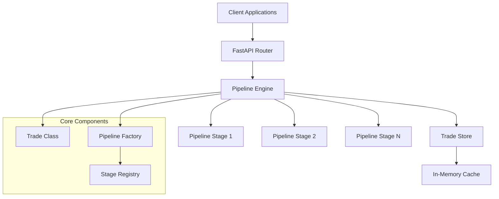

# Trade API Design Document

## Overview

The Trade API is a FastAPI-based system that processes financial trades through modular, configurable pipelines. The architecture supports three distinct trade types (Interest Rate Swaps, Commodity Options, Index Swaps), each with a standardized administrative core (`general` and `common` blocks) and trade-specific economic blocks. The system emphasizes JSON-first processing, composition over inheritance, and pluggable pipeline stages to maximize flexibility while maintaining type safety where necessary.

## Trade Structure Overview

All trades share a common structure:

```json
{
  "general": { /* Shared administrative metadata */ },
  "common": { /* Shared booking and audit data */ },
  /* Trade-specific economic blocks below */
}
```

### Trade Type Structures

**Interest Rate Swap:**
```json
{
  "general": { ... },
  "common": { ... },
  "swapDetails": { "swapType": "irsOis", "underlying": "USD", ... },
  "swapLegs": [
    { "legIndex": 0, "direction": "pay", "rateType": "fixed", ... },
    { "legIndex": 1, "direction": "receive", "rateType": "floating", ... }
  ]
}
```

**Commodity Option:**
```json
{
  "general": { ... },
  "common": { ... },
  "commodityDetails": { "optionExerciseType": "europeanExercise", ... },
  "scheduleDetails": { ... },
  "exercisePayment": { ... },
  "premium": { ... }
}
```

**Index Swap:**
```json
{
  "general": { ... },
  "common": { ... },
  "leg": {
    "underlyingAsset": { "indexCode": "AIAGER", ... },
    "fixedFeeLeg": { ... },
    "floatingIndexLeg": { ... },
    "payment": { ... }
  }
}
```

## Architecture

### High-Level Architecture



### Component Responsibilities

- **FastAPI Router**: HTTP endpoint handling and request/response serialization
- **Pipeline Engine**: Orchestrates execution of pipeline stages
- **Pipeline Factory**: Dynamically constructs pipelines based on operation and trade type
- **Stage Registry**: Manages available pipeline stages and their configurations
- **Trade Class**: Lightweight wrapper around JSON trade data
- **Trade Store**: In-memory persistence layer

## Components and Interfaces

### Trade Class

```python
class Trade:
    """Lightweight composition-based wrapper for trade JSON data.
    
    Uses orjson, jmespath, and glom for high-performance JSON operations.
    """
    
    def __init__(self, data: Union[Dict[str, Any], str, bytes]):
        """Initialize from dict, JSON string, or JSON bytes."""
        self._data = orjson.loads(data) if isinstance(data, (str, bytes)) else data
    
    @property
    def data(self) -> Dict[str, Any]:
        """Direct access to underlying JSON data."""
        return self._data
    
    def jmesget(self, path: str, default: Any = None) -> Any:
        """Get data using JMESPath (for complex queries, filters, projections).
        
        Examples:
            trade.jmesget("legs[0].rate.currency")
            trade.jmesget("legs[?legType=='Fixed'].rate")
            trade.jmesget("legs[*].legId")
        """
        pass
    
    def glomset(self, path: str, value: Any) -> None:
        """Set nested property using glom path notation.
        
        Examples:
            trade.glomset("legs.0.rate", 0.05)
            trade.glomset("specific.rateFamily", "VanillaIRS")
        """
        pass
    
    def to_json(self) -> bytes:
        """Serialize to JSON bytes using orjson."""
        pass
    
    def to_readonly(self) -> 'ReadOnlyTrade':
        """Convert to immutable read-only trade with cached properties."""
        pass


class ReadOnlyTrade:
    """Immutable read-only view with cached properties.
    
    Provides same read interface as Trade but prevents modifications
    and caches expensive property lookups.
    """
    
    def __init__(self, data: Union[Dict[str, Any], Trade]):
        """Initialize with immutable MappingProxyType wrapper."""
        self._data = MappingProxyType(data._data if isinstance(data, Trade) else data)
    
    @property
    def data(self) -> MappingProxyType:
        """Immutable view of underlying data."""
        return self._data
    
    def jmesget(self, path: str, default: Any = None) -> Any:
        """Get data using JMESPath (same as Trade)."""
        pass
    
    @cached_property
    def trade_id(self) -> str:
        """Cached trade ID lookup."""
        pass
    
    @cached_property
    def trade_type(self) -> str:
        """Cached trade type lookup."""
        pass
    
    def to_json(self) -> bytes:
        """Serialize to JSON bytes."""
        pass
```

### Pipeline Stage Interface

```python
from abc import ABC, abstractmethod
from typing import Dict, Any, Optional

class PipelineStage(ABC):
    """Base interface for all pipeline stages."""
    
    @abstractmethod
    def execute(self, trade: Trade, context: Dict[str, Any]) -> Trade:
        """Execute the stage operation on trade data."""
        pass
    
    @property
    @abstractmethod
    def stage_name(self) -> str:
        """Unique identifier for this stage."""
        pass
    
    def validate_preconditions(self, trade: Trade) -> Optional[str]:
        """Validate if stage can execute. Return error message if not."""
        return None
```

### Pipeline Engine

```python
class PipelineEngine:
    """Orchestrates execution of pipeline stages."""
    
    def __init__(self, stage_registry: StageRegistry):
        self.stage_registry = stage_registry
    
    def execute_pipeline(self, 
                        stages: List[str], 
                        trade: Trade, 
                        context: Dict[str, Any] = None) -> Trade:
        """Execute a sequence of pipeline stages."""
        pass
```

### Trade Store Interface

```python
class TradeStore(ABC):
    """Abstract interface for trade persistence."""
    
    @abstractmethod
    def save(self, trade_id: str, trade_data: Dict[str, Any]) -> bool:
        pass
    
    @abstractmethod
    def get(self, trade_id: str) -> Optional[Dict[str, Any]]:
        pass
    
    @abstractmethod
    def exists(self, trade_id: str) -> bool:
        pass
    
    @abstractmethod
    def list_trades(self) -> List[str]:
        pass

class InMemoryTradeStore(TradeStore):
    """In-memory implementation using Python dict."""
    pass
```

## Data Models

### API Request/Response Models

```python
from pydantic import BaseModel
from typing import Dict, Any, Optional, List

class NewTradeRequest(BaseModel):
    trade_type: str
    user_id: Optional[str] = None
    counterparty_a: Optional[Dict[str, str]] = None
    counterparty_b: Optional[Dict[str, str]] = None

class SaveTradeRequest(BaseModel):
    trade_data: Dict[str, Any]
    user_id: Optional[str] = None
    comment: Optional[str] = None

class ValidateTradeRequest(BaseModel):
    trade_data: Dict[str, Any]

class TradeResponse(BaseModel):
    success: bool
    trade_data: Optional[Dict[str, Any]] = None
    errors: List[str] = []
    warnings: List[str] = []
```

### Trade Templates

The system uses a component-based template system for trade generation with two distinct layers:

1. **Administrative Core Templates**: Shared `general` and `common` blocks used by all trade types
2. **Economic Block Templates**: Trade-specific templates for IR Swaps, Commodity Options, and Index Swaps

## Template Factory Architecture

### Overview

The Trade API uses a **two-layer component-based template system** to generate trade structures. This architecture enables:
- **Reusability**: Share administrative core across all trade types
- **Maintainability**: Change core templates to affect all trades
- **Extensibility**: Add new trade types by creating new economic block templates
- **Flexibility**: Each trade type has completely different economic structures
- **Version Control**: Track template changes independently from trade data

### Key Concepts

**Template Schema Version vs Trade Version**:
- **Template Schema Version**: Version of the template structure/format (e.g., v1, v2)
- **Trade Version**: Version of a specific trade instance, incremented on amendments (business version)
- These are completely independent concepts

**Two-Layer Architecture**:
- **Layer 1 - Administrative Core**: Shared `general` and `common` blocks (identical across all trade types)
- **Layer 2 - Economic Blocks**: Trade-specific structures that define financial mechanics

### Directory Structure

```
tcs-api/templates/
├── schema-version/          # Template schema version (v1, v2, etc.)
│   └── v1/                  # Current schema version
│       ├── core/
│       │   ├── general.json              # Shared general block (all trades)
│       │   └── common.json               # Shared common block (all trades)
│       │
│       └── trade-types/
│           ├── ir-swap/
│           │   ├── swap-details.json     # IR Swap specific details
│           │   ├── swap-leg-fixed.json   # Fixed leg template
│           │   ├── swap-leg-floating-ois.json  # OIS floating leg
│           │   └── swap-leg-floating-ibor.json # IBOR floating leg
│           │
│           ├── commodity-option/
│           │   ├── commodity-details.json
│           │   ├── schedule-details.json
│           │   ├── exercise-payment.json
│           │   └── premium.json
│           │
│           └── index-swap/
│               ├── leg-base.json
│               ├── underlying-asset.json
│               ├── fixed-fee-leg.json
│               ├── floating-index-leg.json
│               └── payment.json
```

### Component Assembly Examples

**Example 1: IR Swap (OIS)**

```python
# Assembly order:
components = [
    # Layer 1: Administrative Core (shared)
    "core/general.json",
    "core/common.json",
    
    # Layer 2: IR Swap Economic Blocks
    "trade-types/ir-swap/swap-details.json",
    {
        "swapLegs": [
            "trade-types/ir-swap/swap-leg-fixed.json",
            "trade-types/ir-swap/swap-leg-floating-ois.json"
        ]
    }
]
```

**Example 2: Commodity Option**

```python
# Assembly order:
components = [
    # Layer 1: Administrative Core (shared)
    "core/general.json",
    "core/common.json",
    
    # Layer 2: Commodity Option Economic Blocks
    "trade-types/commodity-option/commodity-details.json",
    "trade-types/commodity-option/schedule-details.json",
    "trade-types/commodity-option/exercise-payment.json",
    "trade-types/commodity-option/premium.json"
]
```

**Example 3: Index Swap**

```python
# Assembly order:
components = [
    # Layer 1: Administrative Core (shared)
    "core/general.json",
    "core/common.json",
    
    # Layer 2: Index Swap Economic Block
    {
        "leg": merge(
            "trade-types/index-swap/leg-base.json",
            "trade-types/index-swap/underlying-asset.json",
            "trade-types/index-swap/fixed-fee-leg.json",
            "trade-types/index-swap/floating-index-leg.json",
            "trade-types/index-swap/payment.json"
        )
    }
]
```

### Example Component Files

**core/general.json** (Shared by ALL trades):
```json
{
  "tradeId": "",
  "label": "",
  "transactionRoles": {
    "marketer": null,
    "transactionOriginator": null,
    "priceMaker": "",
    "transactionAcceptor": null,
    "parameterGrantor": null
  },
  "executionDetails": {
    "executionDateTime": "",
    "bestExecutionApplicable": null,
    "executionVenue": null,
    "venueTransactionID": null,
    "executionBroker": null,
    "executionBrokeragePayer": "wePay",
    "executionVenueMIC": null,
    "executionVenueType": "OffFacility",
    "clearingVenue": null,
    "reportTrackingNumber": null,
    "omsOrderID": null,
    "isOffMarketPrice": false,
    "clientInstructionTime": null
  },
  "packageTradeDetails": {
    "isPackageTrade": false,
    "packageIdentifier": null,
    "packagePriceOrSpread": null,
    "packageType": null,
    "packagePrice": null,
    "packagePriceCcy": null,
    "priceNotation": null,
    "useTradeIdAsPackageId": true
  },
  "blockAllocationDetails": null
}
```

**core/common.json** (Shared by ALL trades):
```json
{
  "book": "",
  "accountReference": null,
  "tradeDate": "",
  "counterparty": "",
  "novatedToCounterparty": null,
  "counterpartyAccountReference": null,
  "inputDate": "",
  "orderTime": null,
  "comment": null,
  "initialMargin": null,
  "backoutBook": null,
  "tradingStrategy": null,
  "ddeEligible": "No",
  "backoutTradingStrategy": null,
  "externalReference": null,
  "internalReference": null,
  "initialMarginDeliveryDate": null,
  "initialMarginDescription": null,
  "structureDetails": null,
  "backoutEntity": null,
  "salesGroup": null,
  "includeFeeEngine": {
    "none": true
  },
  "acsLinkType": null,
  "regionOrAccount": null,
  "originatingSystem": null,
  "stp": "No",
  "sourceSystem": null,
  "cashflowHedgeNotification": false,
  "IRDAdvisory": false,
  "events": [],
  "fees": [],
  "cvr": null,
  "rightToBreakDetails": null,
  "capitalSharing": [],
  "tagMap": [],
  "tradeIdentifiers": []
}
```

**trade-types/ir-swap/swap-details.json** (IR Swap specific):
```json
{
  "underlying": "USD",
  "settlementType": "physical",
  "swapType": "irsOis",
  "isCleared": false,
  "markitSingleSided": false,
  "principalExchange": "firstLastLegs",
  "isIsdaFallback": false
}
```

**trade-types/ir-swap/swap-leg-fixed.json** (Fixed leg for IR Swap):
```json
{
  "legIndex": 0,
  "direction": "pay",
  "currency": "USD",
  "rateType": "fixed",
  "notional": null,
  "scheduleType": "constant",
  "interestRate": null,
  "ratesetRef": null,
  "referenceTenor": null,
  "margin": "marginNone",
  "ratesetOffset": null,
  "paymentOffset": null,
  "ratesetCalendars": [],
  "formula": "ARR",
  "dayCountBasis": "ACT/360",
  "observationMethod": "notApplicable",
  "averagingMethod": "notApplicable",
  "startDate": "",
  "endDate": "",
  "isAdjusted": true,
  "stubDate": null,
  "stubDayCountBasis": null,
  "stubType": "none",
  "alignAtEom": "notEom",
  "style": "notApplicable",
  "rollConvention": null,
  "settlementCurrency": "USD",
  "settlementOffset": 2,
  "fxSettlement": null,
  "paymentCalendars": ["NY"],
  "rollDateConvention": "MFBD",
  "nonStandard": null
}
```

**trade-types/commodity-option/commodity-details.json** (Commodity Option specific):
```json
{
  "optionExerciseType": "europeanExercise",
  "settlementMethod": "CashOrEfrp",
  "accumulation": "None",
  "automaticExercise": false,
  "notionalVolume": {
    "volumeUnit": "LB",
    "volumeFrequency": "Total",
    "volumeFuturesContracts": 0
  },
  "strikeCurrency": "EUR",
  "strikeUnit": "LB",
  "strikePayout": "ITM",
  "pricingStyle": "AVG_CMD_AVG_FX",
  "priceCalculation": {
    "spread": 0,
    "roundingMethod": "halfUp",
    "precision": "3dp",
    "commonPricing": true
  },
  "assetPricing": {
    "ratesetRuleCode": "DuringPeriod",
    "ratesetExprCode": "LIFFE_AG",
    "assetWeight": 1,
    "assetUnit": "LB",
    "commodityCode": "EGT",
    "commodityRateset": "EGT",
    "fixingStyle": "bullet",
    "fixingRounding": "halfUp"
  },
  "fxFixing": {
    "commonPricing": false,
    "averagingCalcMethod": "avgAssetFx",
    "spread": 0,
    "conversionFactor": 0,
    "style": "average",
    "roundingMethod": "halfUp",
    "roundingPrecision": "3dp"
  }
}
```

**trade-types/index-swap/leg-base.json** (Index Swap leg structure):
```json
{
  "underlyingAsset": {
    "indexCode": "",
    "ISIN": null
  },
  "volume": {
    "volumeType": "notional",
    "rounding": "2dp"
  },
  "fixedFeeLeg": {
    "dayCountBasis": "ACT/365",
    "combineFeesTbills": "No",
    "feeStartDate": "",
    "settlement": null
  },
  "floatingIndexLeg": {
    "periods": {
      "singleOrMultiRatesets": "single",
      "ratesetOn": "commodityBusinessDays",
      "startDate": "",
      "endDate": "",
      "rollDateConvention": "MFBD"
    },
    "price": {
      "priceType": "close",
      "referenceDate": "",
      "margin": 0,
      "rounding": "4dp"
    },
    "indexTradeDetails": {
      "hedgeDisruption": "Yes",
      "ateTrigger": "No",
      "reinvesting": "No",
      "stopLoss": "noStopLoss",
      "indexFloatingPerformance": "noFloatingPerformance",
      "linkedTradeableId": null,
      "exitCost": "noExitCost",
      "unilateralUnwindRights": "No",
      "standardIcoh": "Yes",
      "isBreakable": false
    }
  },
  "payment": {
    "paymentCcy": "USD",
    "assetCcy": "USD",
    "paymentDate": null,
    "paymentDaysOffset": 2,
    "dayType": "Business",
    "calendar": ["NY"],
    "rounding": "2dp"
  }
}
```

### TradeTemplateFactory Interface

```python
class TradeTemplateFactory:
    """Factory for creating TradeAssemblers with two-layer template composition.
    
    Composes trade templates from JSON component files based on:
    - Layer 1: Administrative Core (general + common blocks, shared by all)
    - Layer 2: Economic Blocks (trade-specific structures)
    
    Supported trade types:
    - IR Swap: swapDetails + swapLegs[] array
    - Commodity Option: commodityDetails + scheduleDetails + exercisePayment + premium
    - Index Swap: leg object with nested structures
    
    Design principles:
    - Loads JSON components from template files
    - Applies two-layer composition (core + trade-specific)
    - Returns configured TradeAssembler ready to assemble()
    - Caches loaded components for performance
    - Supports extensibility (add new types by adding JSON files)
    """
    
    def __init__(self, template_dir: str, schema_version: str = "v1"):
        """Initialize factory with template directory and schema version."""
        pass
    
    def create_assembler(
        self,
        trade_type: str,
        **kwargs
    ) -> TradeAssembler:
        """Create TradeAssembler for specified trade configuration.
        
        Args:
            trade_type: "ir-swap", "commodity-option", "index-swap"
            **kwargs: Trade-specific parameters:
                For IR Swap:
                    - leg_configs: [{"type": "fixed"}, {"type": "floating-ois"}]
                    - underlying: "USD"
                For Commodity Option:
                    - exercise_type: "europeanExercise"
                    - pricing_style: "AVG_CMD_AVG_FX"
                For Index Swap:
                    - index_code: "AIAGER"
                    - payment_ccy: "USD"
            
        Returns:
            Configured TradeAssembler ready to assemble()
        """
        pass
```

### Architectural Benefits

**1. Clear Separation of Concerns**:
- Administrative core (general + common) is completely separate from economic blocks
- Change core templates → affects ALL trade types
- Change trade-specific templates → affects only that trade type
- No duplication between trade types

**2. Trade Type Independence**:
```
core/general.json           # ALL trades
core/common.json            # ALL trades
  ├─ ir-swap/               # IR Swap only
  ├─ commodity-option/      # Commodity Option only
  └─ index-swap/            # Index Swap only
```

**3. Maintainability**:
- Add field to core → all trades inherit automatically
- Each trade type has its own economic structure
- No complex inheritance chains to navigate
- Clear file organization by trade type

**4. Extensibility**:
- Add new trade type: Create new folder under `trade-types/`
- Add new leg type for IR Swaps: Create new file under `ir-swap/`
- Add new option type: Create new folder under `commodity-option/`
- No code changes required

**5. Version Control**:
- Template changes tracked in git
- Schema versions isolated (`v1/`, `v2/`)
- Non-developers can modify templates
- Easy rollback of template changes

### Use Cases

**Use Case 1: Add field to ALL trades**

Scenario: Add `"regulatoryReportingRequired": true` to every trade

Solution: Edit `core/common.json`:
```json
{
  "book": "",
  "counterparty": "",
  "regulatoryReportingRequired": true,  // ← Added here, ALL trades inherit
  ...
}
```

Result: Every trade type (IR Swap, Commodity Option, Index Swap) now has this field

**Use Case 2: Add field to IR Swaps only**

Scenario: Add `"clearingHouse": ""` to IR Swaps but not other trade types

Solution: Edit `trade-types/ir-swap/swap-details.json`:
```json
{
  "underlying": "USD",
  "swapType": "irsOis",
  "clearingHouse": "",  // ← Only IR Swaps
  ...
}
```

Result: Only IR Swaps have this field, Commodity Options and Index Swaps don't

**Use Case 3: Add new trade type**

Scenario: Add "FX Forward" trade type

Solution:
1. Create `trade-types/fx-forward/` folder
2. Add `fx-forward-details.json` with trade-specific fields
3. Add any additional economic block files needed
4. Factory automatically discovers and uses new components

No code changes required!

### Template Schema Versioning

**Purpose**: Support multiple template formats for backward compatibility

**Structure**:
```
templates/
├── v1/          # Original format (payerPartyCode, etc.)
│   └── ...
└── v2/          # Newer format (payer, etc.)
    └── ...
```

**Usage**:
```python
# Use v1 templates (original format)
factory_v1 = TradeTemplateFactory(template_dir="templates", schema_version="v1")

# Use v2 templates (newer format)
factory_v2 = TradeTemplateFactory(template_dir="templates", schema_version="v2")
```

**Important**: Template schema version is completely independent from trade version:
- **Template schema version**: Format/structure of templates (v1, v2, etc.)
- **Trade version**: Business version of a specific trade instance (1, 2, 3, etc.)
- A trade at version 5 can be created using template schema v1 or v2

### Performance Considerations

**Component Caching**:
```python
@lru_cache(maxsize=256)
def _load_component(filepath: str) -> dict:
    """Cache loaded JSON components for performance."""
    with open(filepath, 'rb') as f:
        return orjson.loads(f.read())
```

**Benefits**:
- Components loaded once, reused across requests
- Fast template assembly (no repeated file I/O)
- Configurable cache size based on template count

### Extensibility Guidelines

**Adding New Trade Types**:
1. Create folder: `trade-types/{new-type}/`
2. Add economic block files specific to that trade type
3. Update factory to recognize new trade type
4. Templates automatically loaded

**Adding New Variations Within Trade Types**:

For IR Swaps:
1. Create new leg template: `trade-types/ir-swap/swap-leg-{new-type}.json`
2. Define leg-specific fields

For Commodity Options:
1. Add new exercise type or pricing style templates
2. Create variant files as needed

For Index Swaps:
1. Add new index-specific templates
2. Create variant leg structures

All additions are discovered automatically by the factory!


## Correctness Properties

*A property is a characteristic or behavior that should hold true across all valid executions of a system-essentially, a formal statement about what the system should do. Properties serve as the bridge between human-readable specifications and machine-verifiable correctness guarantees.*

<function_calls>
<invoke name="prework">
<parameter name="featureName">trade-api

Property 1: Trade ID generation consistency
*For any* supported trade type, creating a new trade should generate a trade ID that matches the format SWAP-YYYYMMDD-TYPE-NNNN
**Validates: Requirements 1.2**

Property 2: Template field population
*For any* new trade request with optional parameters, the generated template should contain all provided parameters in their correct JSON locations
**Validates: Requirements 1.3, 1.4**

Property 3: JSON round-trip preservation
*For any* valid trade JSON data, saving and then retrieving the trade should return identical JSON structure
**Validates: Requirements 2.3, 6.3**

Property 4: Version increment consistency
*For any* existing trade, updating it should increment the version number by exactly one and add a new lifecycle entry
**Validates: Requirements 2.2**

Property 5: Pipeline stage execution order
*For any* pipeline configuration, stages should execute in the specified sequence with each stage receiving the output of the previous stage
**Validates: Requirements 4.2**

Property 6: Validation error completeness
*For any* invalid trade data, the validation endpoint should return all validation errors without stopping at the first failure
**Validates: Requirements 3.3**

Property 7: Trade store key uniqueness
*For any* trade ID, the store should maintain exactly one trade record per ID, with later saves overwriting earlier ones
**Validates: Requirements 6.2**

Property 8: Pipeline error handling
*For any* pipeline stage that fails, execution should halt immediately and return error information without executing subsequent stages
**Validates: Requirements 4.3**

Property 9: JSON flexibility preservation
*For any* valid JSON trade structure, the Trade class should provide access to all original properties without schema enforcement
**Validates: Requirements 5.3**

Property 10: Trade type pipeline selection
*For any* trade type and operation combination, the system should select the appropriate pipeline stages without manual configuration
**Validates: Requirements 4.1**

## Error Handling

### Error Categories

1. **Validation Errors**: Invalid trade data, missing required fields, business rule violations
2. **Pipeline Errors**: Stage execution failures, precondition violations
3. **Storage Errors**: Persistence failures, concurrency conflicts
4. **System Errors**: Unexpected exceptions, resource constraints

### Error Response Format

```python
class ErrorResponse(BaseModel):
    success: bool = False
    error_code: str
    message: str
    details: Optional[Dict[str, Any]] = None
    timestamp: str
```

### Error Handling Strategy

- **Fail Fast**: Pipeline execution stops on first error
- **Error Aggregation**: Validation collects all errors before returning
- **Graceful Degradation**: Non-critical failures logged but don't stop processing
- **Error Context**: Include relevant trade data and stage information in error responses

## Testing Strategy

### Dual Testing Approach

The system requires both unit testing and property-based testing to ensure correctness:

**Unit Tests**:
- Test specific pipeline stages with known inputs
- Verify API endpoint request/response handling
- Test error conditions and edge cases
- Validate trade store operations

**Property-Based Tests**:
- Verify universal properties across all trade types and inputs
- Test JSON round-trip consistency
- Validate pipeline execution properties
- Test concurrent access patterns

### Property-Based Testing Framework

The system will use **Hypothesis** for property-based testing in Python. Each property-based test will:
- Run a minimum of 100 iterations
- Use smart generators for trade data
- Be tagged with comments referencing design document properties

**Test Configuration**:
```python
from hypothesis import given, strategies as st, settings

@settings(max_examples=100)
@given(trade_data=trade_json_strategy())
def test_json_round_trip_property(trade_data):
    """**Feature: trade-api, Property 3: JSON round-trip preservation**"""
    # Test implementation
```

### Test Data Generation

Smart generators will create realistic trade data:
- Valid trade IDs following the required format
- Appropriate date ranges and business day handling
- Realistic financial values and rate structures
- Valid counterparty and user information

### Integration Testing

- End-to-end API workflow testing
- Pipeline composition and execution testing
- Concurrent request handling
- Memory usage and performance validation

## Implementation Notes

### Technology Stack
- **FastAPI**: Web framework for API endpoints
- **Pydantic**: Request/response validation only
- **orjson**: Fast JSON serialization/deserialization (2-3x faster than stdlib)
- **jmespath**: Powerful JSON query language for complex reads (filters, projections)
- **glom**: Robust path-based writes with automatic structure creation
- **Hypothesis**: Property-based testing
- **pytest**: Unit testing framework
- **uvicorn**: ASGI server

### Performance Considerations
- In-memory store for fast access during development
- Lazy loading of pipeline stages
- Minimal object creation overhead
- JSON processing optimization

### Future Extensibility
- Plugin architecture for new trade types
- Database abstraction for PostgreSQL migration
- Pipeline stage marketplace/registry
- Configuration-driven pipeline construction